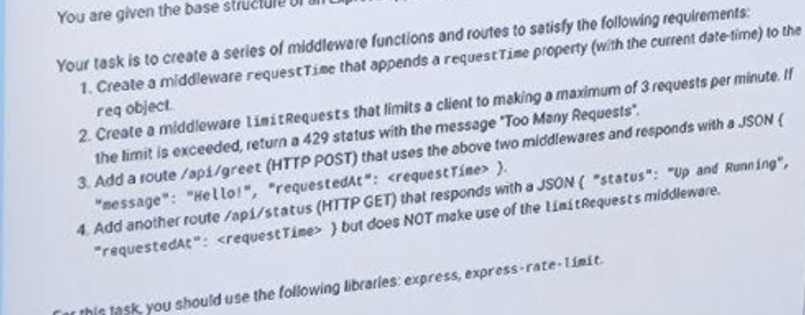

# HW 7 solve challenge described on the attached screenshot from exam
In the express-rate-limit third party middleware you may use only fields (see documentation) that you logically understand windowMs, max and message
In the current  release (8.0.1) of express-rate-limit middleware there is mismatch of doc with the  usage.  Documentation: import {rateLimit} from "express-rate-limit"  but in the usage there should be import rateLimit from "express-rate-limit" ;  documentation: a configuration object being passed to the function rateLimit there is field "limit" but in the usage there should be field "max" for limiting number of the requests per "windowMs" timing window